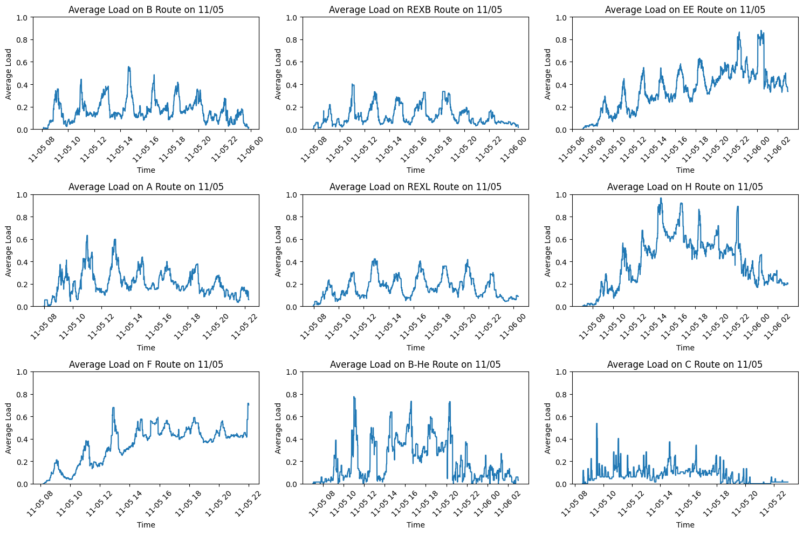
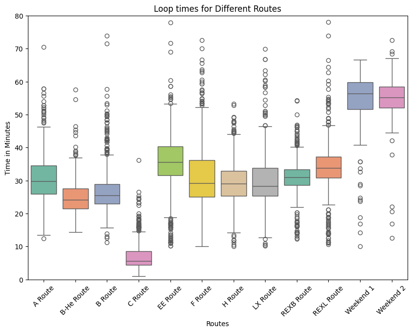
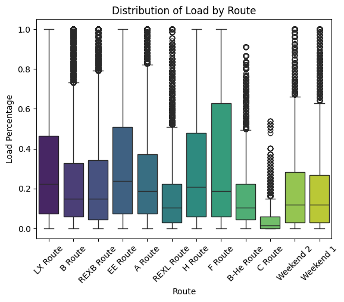
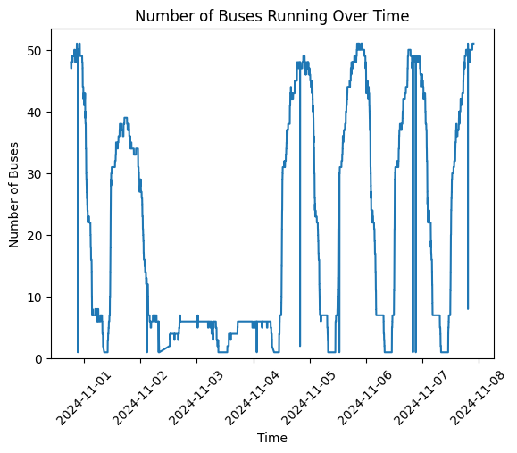
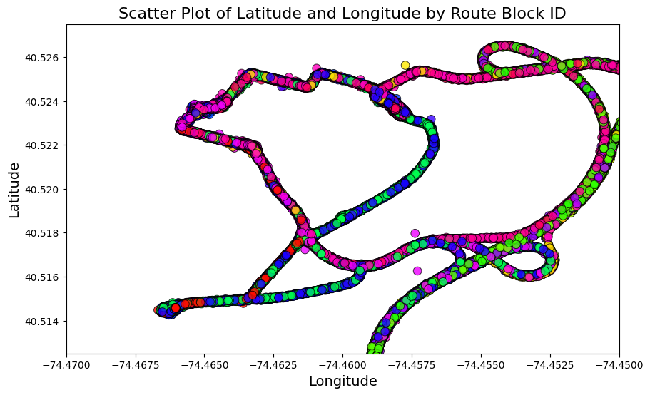
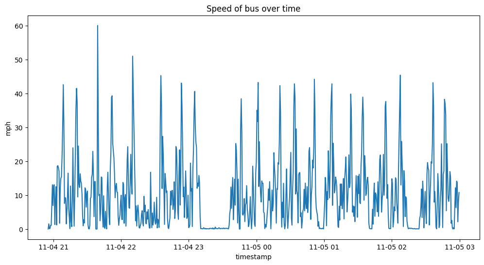
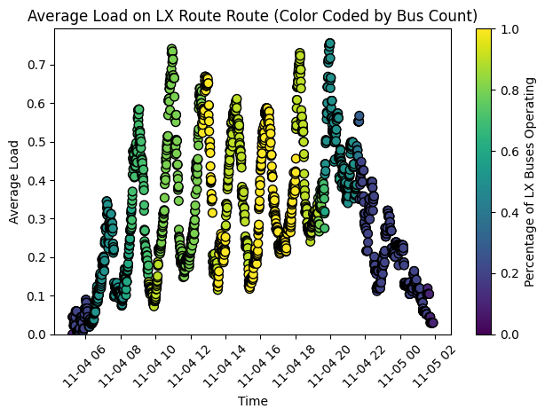
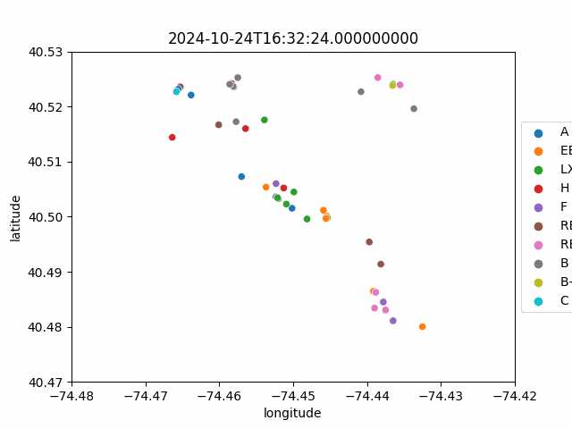
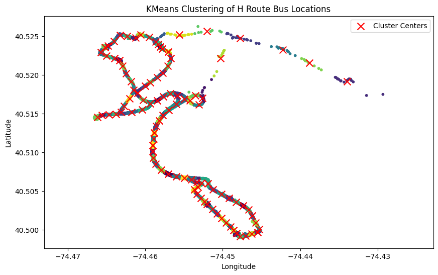

# Rutgers Bus Transit Analysis

A data analysis project examining Rutgers University's bus transit system through various metrics including wait times, route patterns, and stop clustering.


## Cool Graphs


*My favorite graph from this project*



*Same graph but for every route*



*Calculated loop times during post processing for each route*



*Useful to see which buses are most full*



*Total buses operating during the week*



*This is a cool graph that I made while exploring*



*Speed of a bus serving the LX, H, REXB, EE, and F Routes. (Bus ID 4875)*



*Color coded by buses in operation*


*Example visualization showing bus wait times for A Route throughout the day*

## Project Overview

This project analyzes Rutgers University bus transit data to understand patterns, optimize routes, and improve service reliability. It combines real-time bus tracking data with historical records to generate insights about:
- Bus route completion times
- Stop wait times
- Geographic clustering of bus locations
- Load patterns throughout the day

## Data Collection

The project uses a custom Python script to collect real-time bus data from the Rutgers PassioGO system. Key aspects of the data collection:

### Collection Script
- Polls the PassioGO API every 30 seconds
  - I had to change the API because there was a mistake in it. Here's [my pull request](https://github.com/athuler/PassioGo/pull/32).
- Captures comprehensive bus metrics including:
  - Location (latitude/longitude)
  - Route information
  - Passenger load
  - Vehicle details
  - Timestamps
- Automatically handles API interruptions
- Appends new data to a CSV file

### Collection Infrastructure
- Hosted on Azure Virtual Machine for reliability
- Ran continuously for one week
- Collected over 43MB of structured transit data
- Approximately 31,000+ data points gathered
- Data saved in CSV format for easy analysis

### Data Fields
- Vehicle ID and type
- Route names and block IDs
- Geographic coordinates
- Passenger load and capacity
- Calculated course
- Device and trip identifiers
- Precise timestamps

The collection script (`save.py`) was designed to be fault-tolerant, handling API interruptions gracefully while maintaining data integrity. Running on Azure ensured consistent uptime and reliable data collection throughout the week-long period.

Sample data growth metrics:
- Initial size: 6KB
- 1 hour: ~1MB
- 12 hours: ~14MB
- 24 hours: ~28MB
- 1 week: ~100MB

## Features

### 1. Route Analysis
- Box plot comparisons of route completion times
- Statistical analysis of route efficiency
- Outlier detection and filtering



A random gif with buses moving

### 2. Wait Time Analysis


- Combined scatter and density plots showing wait patterns
- Time-of-day correlation analysis
- Average wait time calculations by stop

### 3. Geographic Clustering
- K-means clustering of bus locations
- Interactive map visualization (in development)
- Stop location analysis

(This didn't really work out as well as I wanted it to)



### 4. Website to display some data
- go through each each time and watch the buses move [on the map](https://akeboss-tech.github.io/RutgersBusAnalysis/)!
- you can also see all the data collected for each route [A Route](https://akeboss-tech.github.io/RutgersBusAnalysis/maps/A%20Route_map.html)

## File Structure

```
project/
│
├── Data Extraction/
│   ├── time.ipynb           - Processes timing data
│   │   ├── Route completion times
│   │   ├── Wait time calculations
│   │   └── Time series preprocessing
│   │
│   └── stops.ipynb          - Stop-specific data processing
│       ├── Stop identification
│       ├── Wait time calculations
│       └── Route-stop mapping
│
├── Data Visualization/
│   ├── bus.ipynb           - Individual bus analysis
│   │   ├── Speed over time plots
│   │   ├── Geographic scatter plots
│   │   └── Stop frequency visualizations
│   │
│   ├── another.ipynb       - Route-level analysis
│   │   ├── Load pattern comparisons
│   │   ├── 3x3 grid route comparisons
│   │   └── Wait time distributions
│   │
│   └── loop.ipynb          - Route loop analysis
│       ├── Loop completion visualizations
│       ├── Route efficiency comparisons
│       └── Time series plots
│
├── Data/
│   ├── stops.json          - Stop location data
│   ├── new_brunswick.txt   - Route definitions
│   └── route_data/         - Raw CSV data files
│       ├── A_Route.csv
│       ├── B_Route.csv
│       └── ...
│
├── Graphs/                 - Generated visualizations
│   ├── A_Route_stopped.png
│   ├── B_Route_stopped.png
│   └── ...
│
├── Maps/                   - Interactive map files
│   ├── buses.gif
│   └── route_maps/
│       ├── A_Route_map.html
│       └── ...
│
└── save.py                - Data collection script
```

### Data Extraction Files
- **time.ipynb**: Processes raw bus data to extract timing information. Handles timestamp conversions, calculates route completion times, and processes time-based metrics.
- **stops.ipynb**: Focuses on stop-related data processing. Identifies bus stops, calculates wait times, and maps stops to routes.

### Data Visualization Files
- **bus.ipynb**: Creates visualizations for individual bus metrics including:
  - Speed patterns over time
  - Geographic distribution of buses
  - Stop frequency analysis
  - Wait time patterns

- **another.ipynb**: Generates route-level visualizations showing:
  - Passenger load patterns
  - Route comparisons in 3x3 grid format
  - Wait time distributions across routes
  - Peak usage periods

- **loop.ipynb**: Visualizes route loop patterns including:
  - Route completion times
  - Efficiency comparisons between routes
  - Time series analysis of route performance

### Supporting Files
- **save.py**: Python script for data collection from PassioGO API
- **stops.json**: JSON file containing stop location data
- **new_brunswick.txt**: Text file containing route definitions
- **route_data/*.csv**: Raw data files for each route
- **graphs/**: Directory containing generated static visualizations
- **maps/**: Directory containing interactive map visualizations

Each notebook is designed to work independently but can be run sequentially for a complete analysis pipeline from raw data to final visualizations. You may need to change some of the paths to data sources. Try pulling an older version of this project to fix it.

## Technologies Used

- **Python 3.11**
- **Data Analysis**: Pandas, NumPy
- **Visualization**: 
  - Matplotlib
  - Seaborn
  - Folium (for mapping)
- **API Integration**: Requests
- **Web Scraping**: BeautifulSoup4

## Getting Started

1. Clone the repository
```bash
git clone https://github.com/yourusername/rutgers-bus-analysis.git
```

2. Install required packages
```bash
pip install -r requirements.txt
```

3. Run Jupyter notebooks
```bash
jupyter notebook
```

## Key Findings

- Peak wait times occur during class change periods
- Route efficiency varies significantly by time of day
- Certain stops show consistent clustering patterns
- Load patterns follow predictable daily cycles

## Future Improvements

- Compressing data into smaller format
- Real-time prediction model for wait times
- Interactive web dashboard
- Create an app to provide real-time bus tracking for riders on iOS and Android
- Machine learning for route optimization
- Weather impact analysis

## License

This project is licensed under the MIT License - see the LICENSE file for details.

## Contact

For questions or collaboration opportunities, please open an issue or contact me.

---
*Note: This project is for research and analysis purposes only and is not officially affiliated with Rutgers University.*
