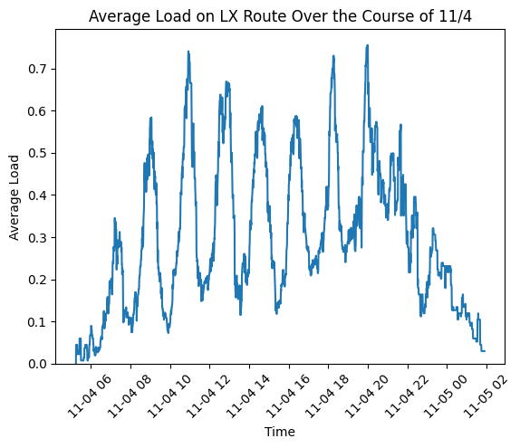
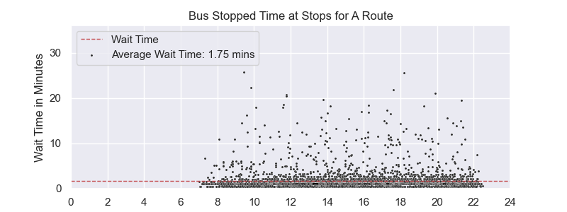

# Rutgers Bus Transit Analysis

A data analysis project examining Rutgers University's bus transit system through various metrics including wait times, route patterns, and stop clustering.


*Example visualization showing bus wait times for A Route throughout the day*

## Cool Graphs



## Project Overview

This project analyzes Rutgers University bus transit data to understand patterns, optimize routes, and improve service reliability. It combines real-time bus tracking data with historical records to generate insights about:
- Bus route completion times
- Stop wait times
- Geographic clustering of bus locations
- Load patterns throughout the day

## Data Collection

The project uses a custom Python script to collect real-time bus data from the Rutgers PassioGO system. Key aspects of the data collection:

### Collection Script
- Polls the PassioGO API every 30 seconds
  - I had to change the API because there was a mistake in it. Here's [my pull request](https://github.com/athuler/PassioGo/pull/32).
- Captures comprehensive bus metrics including:
  - Location (latitude/longitude)
  - Route information
  - Passenger load
  - Vehicle details
  - Timestamps
- Automatically handles API interruptions
- Appends new data to a CSV file

### Collection Infrastructure
- Hosted on Azure Virtual Machine for reliability
- Ran continuously for one week
- Collected over 43MB of structured transit data
- Approximately 31,000+ data points gathered
- Data saved in CSV format for easy analysis

### Data Fields
- Vehicle ID and type
- Route names and block IDs
- Geographic coordinates
- Passenger load and capacity
- Calculated course
- Device and trip identifiers
- Precise timestamps

The collection script (`save.py`) was designed to be fault-tolerant, handling API interruptions gracefully while maintaining data integrity. Running on Azure ensured consistent uptime and reliable data collection throughout the week-long period.

Sample data growth metrics:
- Initial size: 6KB
- 1 hour: ~1MB
- 12 hours: ~14MB
- 24 hours: ~28MB
- 1 week: ~100MB

## Features

### 1. Route Analysis
- Box plot comparisons of route completion times
- Statistical analysis of route efficiency
- Outlier detection and filtering

### 2. Wait Time Analysis

- Combined scatter and density plots showing wait patterns
- Time-of-day correlation analysis
- Average wait time calculations by stop

### 3. Geographic Clustering
- K-means clustering of bus locations
- Interactive map visualization (in development)
- Stop location analysis

### 4. Load Analysis
- Passenger load tracking throughout routes
- Capacity utilization metrics
- Peak time identification

## File Structure

```
project/
│
├── analyze.ipynb - Clustering and geographic analysis
├── loops.ipynb - Route timing analysis
├── stops.ipynb - Wait time analysis
├── main.ipynb - API connection and mapping
├── bus.ipynb - Basic data exploration
├── time.ipynb - Timing data analysis
│
├── data/
│   ├── stops.json
│   └── route_data/*.csv
│
└── graphs/
    ├── A_Route_stopped.png
    ├── B_Route_stopped.png
    └── ...
```

## Technologies Used

- **Python 3.11**
- **Data Analysis**: Pandas, NumPy
- **Visualization**: 
  - Matplotlib
  - Seaborn
  - Folium (for mapping)
- **API Integration**: Requests
- **Web Scraping**: BeautifulSoup4

## Getting Started

1. Clone the repository
```bash
git clone https://github.com/yourusername/rutgers-bus-analysis.git
```

2. Install required packages
```bash
pip install -r requirements.txt
```

3. Run Jupyter notebooks
```bash
jupyter notebook
```

## Key Findings

- Peak wait times occur during class change periods
- Route efficiency varies significantly by time of day
- Certain stops show consistent clustering patterns
- Load patterns follow predictable daily cycles

## Future Improvements

- Compressing data into smaller format
- Real-time prediction model for wait times
- Interactive web dashboard
- Create an app to provide real-time bus tracking for riders on iOS and Android
- Machine learning for route optimization
- Weather impact analysis

## License

This project is licensed under the MIT License - see the LICENSE file for details.

## Contact

For questions or collaboration opportunities, please open an issue or contact me.

---
*Note: This project is for research and analysis purposes only and is not officially affiliated with Rutgers University.*
